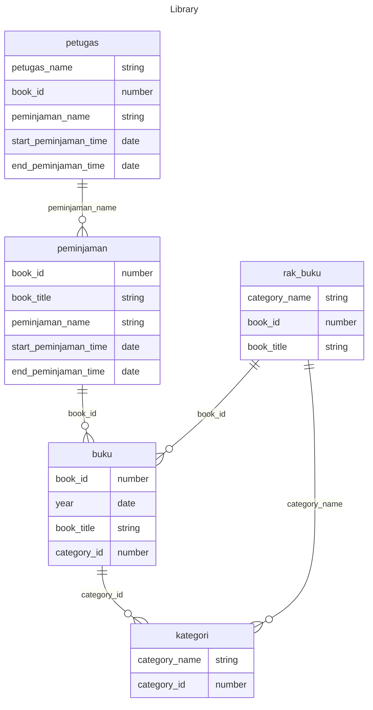

```mermaid
---
title: Library
---
  erDiagram
  buku {
    book_id number
    year date
    book_title string 
    category_id number
  }
  
  kategori {
    category_name string
    category_id number
  }

  rak_buku {
    category_name string
    book_id number
    book_title string
  }

  petugas {
    petugas_name string
    book_id number
    peminjaman_name string
    start_peminjaman_time date
    end_peminjaman_time date
  }

  peminjaman {
    book_id number
    book_title string
    peminjaman_name string
    start_peminjaman_time date
    end_peminjaman_time date
  }

  buku ||--o{ kategori : category_id
  rak_buku ||--o{ kategori : category_name
  petugas ||--o{ peminjaman : peminjaman_name
  peminjaman ||--o{ buku : book_id
  rak_buku ||--o{ buku : book_id

```