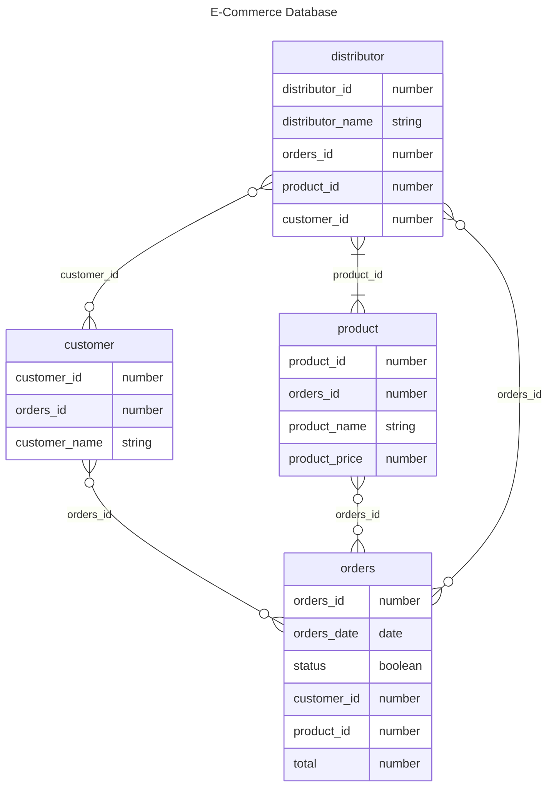

```mermaid
---
title: E-Commerce Database
---
  erDiagram
  customer {
    customer_id number
    orders_id number
    customer_name string
  }

  product {
    product_id number
    orders_id number
    product_name string
    product_price number
  }

  orders {
    orders_id number
    orders_date date
    status boolean
    customer_id number
    product_id number
    total number
  }

  distributor {
    distributor_id number
    distributor_name string
    orders_id number
    product_id number
    customer_id number
  }

  customer }o--o{ orders : orders_id
  product }o--o{ orders : orders_id
  distributor }|--|{ product : product_id
  distributor }o--o{ customer : customer_id
  distributor }o--o{ orders : orders_id
```